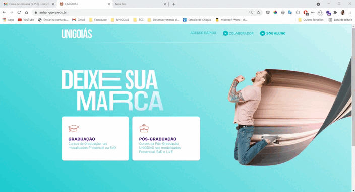

# Página Inicial (Home) UNIGOIÁS
Home page constrúida para a campanha de captação de 2021/2 da UNIGOIÁS
### Campanha 2021/2

__Descrição das ferramentas:__
Desenvolvimento utilizando HTML5, Sass transpilando para CSS3, JavaScript. Utilizou-se webpack 
para gerenciar alguns pacotes + babel para transpilar o código para ser lido pela maioria dos 
navegadores, sem tanta necessidade de utilização de webkit e para viabilizar o uso do ECMAScript

[Visualize a página implantada](https://anhanguera.edu.br/)
> Se estiver acessando esta página posteriormente ao ano de 2021, possivelmente a página estará diferente
> em virtude do período de campanha à qual a página foi destinada.

